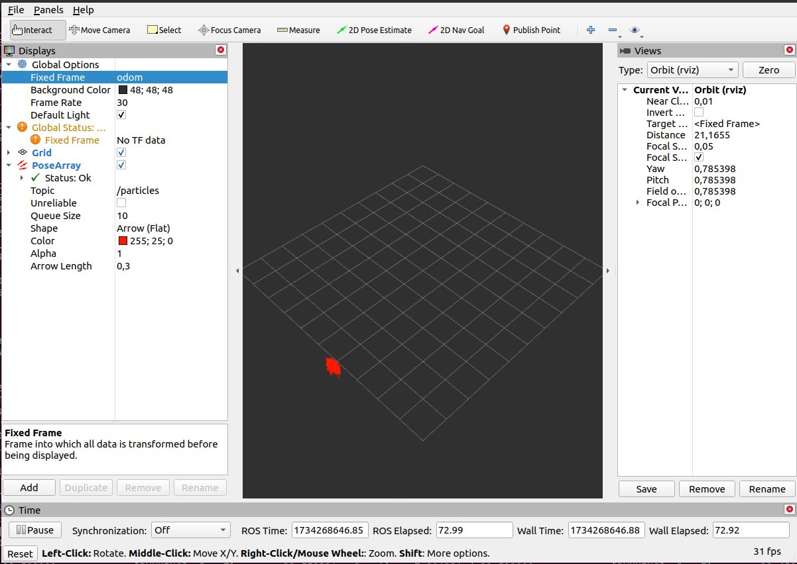
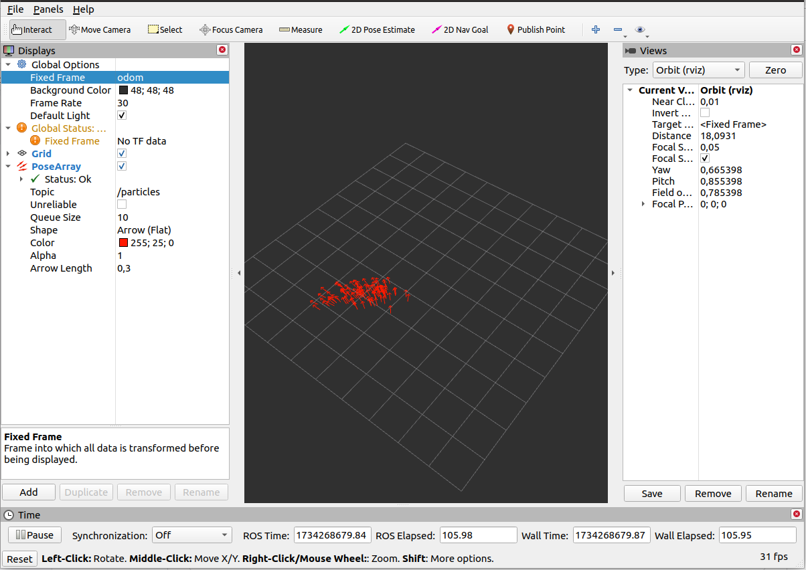
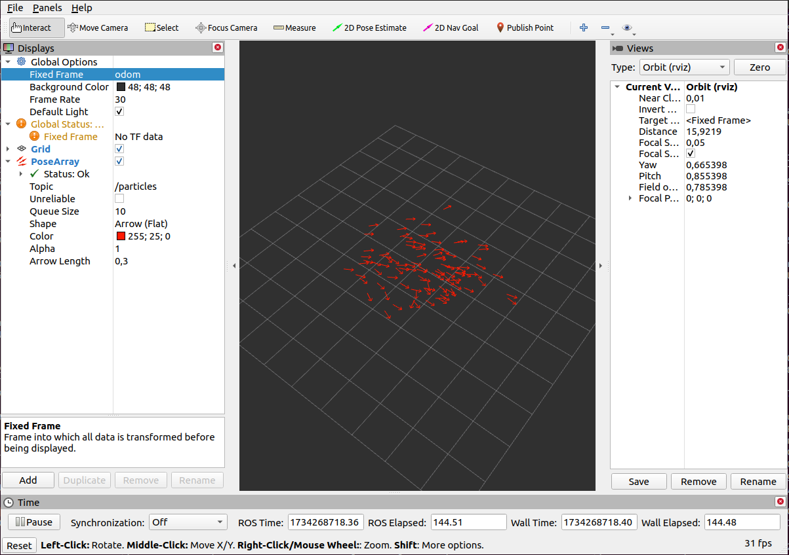

# Incremental Odometry

This project implements incremental odometry for ROS Noetic. The odometry values are directly utilized to compute the robot's position and orientation over time, without relying on wheel encoder data. By processing odometry messages, the robot's pose (position and orientation) is estimated incrementally, providing accurate real-time tracking for various robotic applications. This implementation is designed to integrate seamlessly with the ROS ecosystem and supports scenarios where only odometry data is available. 


# Install particle_filter package for using bag file

## Creating workspace
```
mkdir -p ~/robotlar_ws/src
cd ~/robotlar_ws
source devel/setup.bash
catkin_make
```


## Clone and compile 

```
# 1. Go to the workspace source directory
cd ~/robotlar_ws/src

# 2. Clone the GitHub repository
git clone https://github.com/mertColpan/university_projects-.git

# 3. Move only the solve_maze package into src
mv university_projects-/particle_filter ./

# 4. Remove the now-unnecessary cloned repository folder
rm -rf university_projects-

# 5. Go back to the root of the workspace
cd ~/robotlar_ws

# 6. Install dependencies
rosdep install --from-paths src --ignore-src -r -y

# 7. Build the workspace
catkin_make

# 8. Source the setup files
source devel/setup.bash
source ~/.bashrc
```

# Install incremental_odometry package

```

# 1. Go to the workspace source directory
cd ~/robotlar_ws/src

# 2. Clone the GitHub repository
git clone https://github.com/mertColpan/university_projects-.git

# 3. Move only the solve_maze package into src
mv university_projects-/incremental_odometry ./

# 4. Remove the now-unnecessary cloned repository folder
rm -rf university_projects-

# 5. Go back to the root of the workspace
cd ~/robotlar_ws

# 6. Install dependencies
rosdep install --from-paths src --ignore-src -r -y

# 7. Build the workspace
catkin_make

# 8. Source the setup files
source devel/setup.bash
source ~/.bashrc

```


# Run

## Play odom.bag File

```
$ cd ~/robotlar_ws
$ source ~/.bashrc
$ roscore
[CTRL+SHIFT+T]
$ rosbag play $(rospack find particle_filter)/odom.bag
```

## Run incremental_odometry node 
```
[CTRL+SHIFT+T]
$ rosrun incremental_odometry incremental_odometry_node.py
[CTRL+SHIFT+T]
rviz
```


# Results

## Bag file duration in 50 sec





## Bag file duration in 70 sec





## Bag file duration in 100 sec





