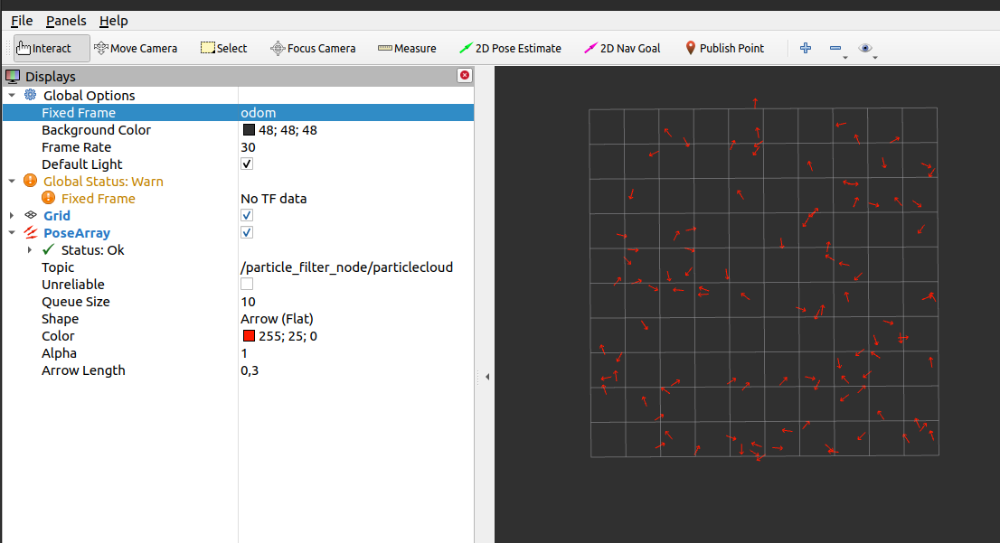

# particle_filter_node

## Compile particle_filter node

```
# 1. Go to the workspace source directory
cd ~/robotlar_ws/src

# 2. Clone the GitHub repository
git clone https://github.com/mertColpan/university_projects-.git

# 3. Move only the solve_maze package into src
mv university_projects-/particle_filter ./

# 4. Remove the now-unnecessary cloned repository folder
rm -rf university_projects-

# 5. Go back to the root of the workspace
cd ~/robotlar_ws

# 6. Install dependencies
rosdep install --from-paths src --ignore-src -r -y

# 7. Build the workspace
catkin_make

# 8. Source the setup files
source devel/setup.bash
source ~/.bashrc
```


## Run particle_filter node

~~~
[CTRL+ALT+T]
$ roscore
[CTRL+SHIFT+T]
$ rosrun particle_filter particle_filter_node _numParticles:=200
[CTRL+SHIFT+T]
$ rviz
~~~

In RVIZ make sure you have the same config with the following figure.



particle_filter_node can be run with default parameter value 100 skipping the  numParticles parameter, 
~~~
rosrun particle_filter particle_filter_node
~~~

or can be run with a custom vaule (200) for numParticles parameter
~~~
rosrun particle_filter particle_filter_node _numParticles:=200
~~~

# odom Bag

## Play odom.bag File

~~~
$ rosbag play $(rospack find particle_filter)/odom.bag
~~~
