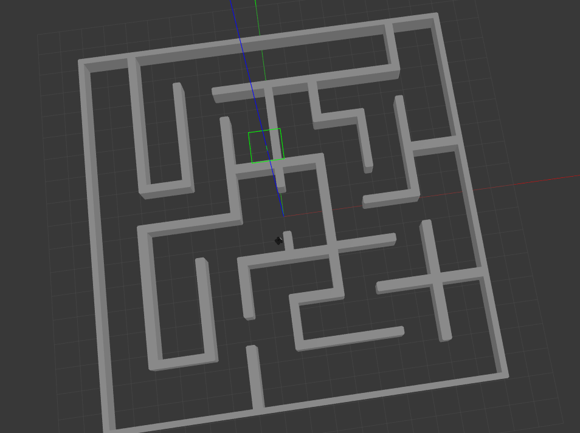
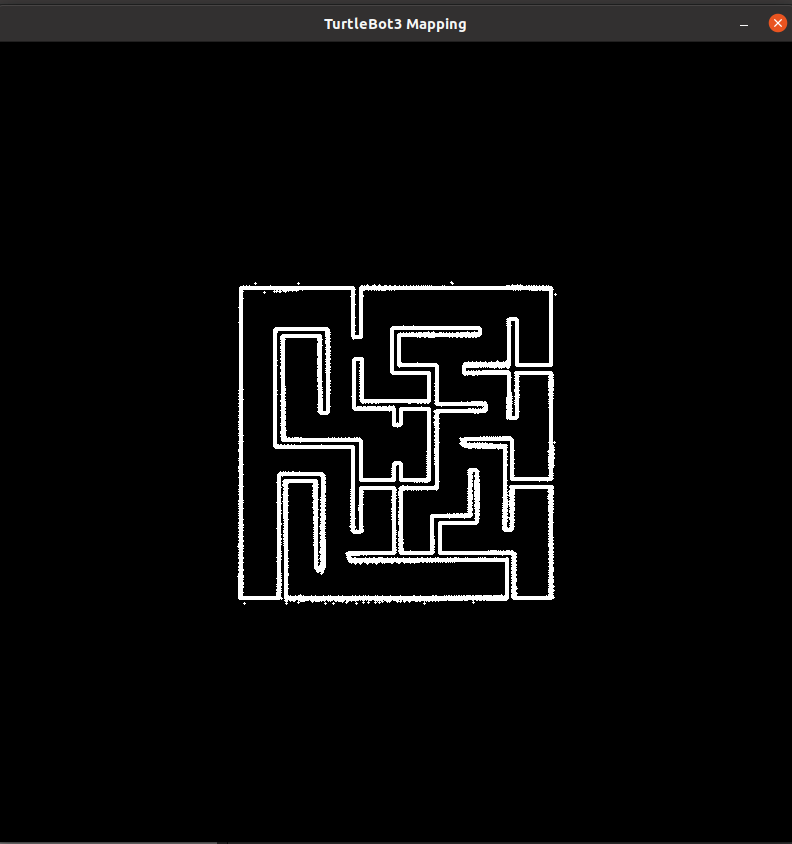
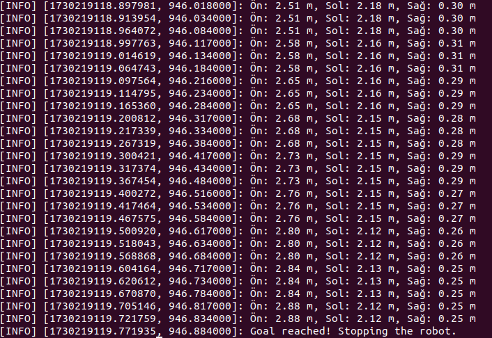

# solve_maze

This project is a ROS Noetic-based maze-solving application.
The goal is for the robot to explore its surroundings by mapping a predefined environment and solve the maze to reach a specific target.

# Creating workspace
```
mkdir -p ~/robotlar_ws/src
cd ~/robotlar_ws
source devel/setup.bash
catkin_make
```

# Install

```
# 1. Go to the workspace source directory
cd ~/robotlar_ws/src

# 2. Clone the GitHub repository
git clone https://github.com/mertColpan/university_projects-.git

# 3. Move only the solve_maze package into src
mv university_projects-/solve_maze ./

# 4. Remove the now-unnecessary cloned repository folder
rm -rf university_projects-

# 5. Go back to the root of the workspace
cd ~/robotlar_ws

# 6. Install dependencies
rosdep install --from-paths src --ignore-src -r -y

# 7. Build the workspace
catkin_make

# 8. Source the setup files
source devel/setup.bash
source ~/.bashrc

```


Make sure that you have defined waffle as default robot type
```
echo "export TURTLEBOT3_MODEL=waffle" >> ~/.bashrc
source ~/.bashrc
```

Also make sure your workspace is defined within GAZEBO_MODEL_PATH variable
```
echo "export GAZEBO_MODEL_PATH=${GAZEBO_MODEL_PATH}:~/robotlar_ws/src/" >> ~/.bashrc
source ~/.bashrc
```

# Run

Make sure cloning maze before this package

Run with maze 4:
```
roslaunch micromouse_maze micromouse_maze4.launch
```
Run the wall_follower node:
```
# open new terminal and run this command
cd ~/robotlar_ws
rosrun solve_maze my_mapper.py

```
Run the mapping node:
```
# open new terminal and run this command
cd ~/robotlar_ws
rosrun solve_maze my_solver.py

```


# Final position of robot wall following algorithm





# Full map of maze4 with using my_mapping node





# Terminal output of my_solver node



